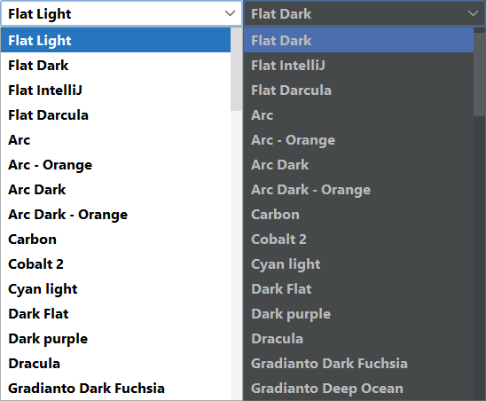

# FlatlafThemesComboBoxModel
[](https://javadoc.io/doc/io.github.kolod/flatlaf-themes-combobox-model)[](https://maven-badges.herokuapp.com/maven-central/io.github.kolod/flatlaf-themes-combobox-model)

The ComboBox model for the [FlatLaf](https://github.com/JFormDesigner/FlatLaf) themes.



## Download
FlatlafThemesComboBoxModel binaries are available on **Maven Central**.

If you use Maven or Gradle, add a dependency with following coordinates to your
build script:

```yaml
    groupId:     com.formdev
    artifactId:  flatlaf
    version:     (see button below)
```
Otherwise download  `flatlaf-themes-combobox-model-<version>.jar` here:

[](https://maven-badges.herokuapp.com/maven-central/io.github.kolod/flatlaf-themes-combobox-model)

## Usage

Place the `JComboBox` component on your form and then set the model to an instance of the `FlatlafThemesComboBoxModel`.

```java
private static FlatlafThemesComboBoxModel themesModel;
private javax.swing.JComboBox<String> themesComboBox;
...
themesModel = new FlatlafThemesComboBoxModel();
themesComboBox = new javax.swing.JComboBox<>();
themesComboBox.setModel(themesModel);
```
